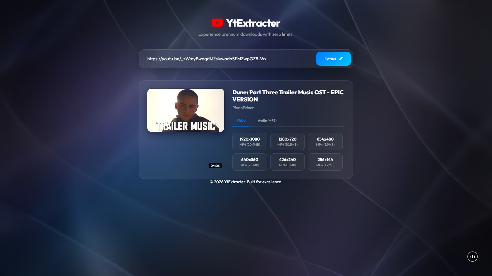

# FluxTube

<div align="center">

```
███████╗██╗     ██╗   ██╗██╗  ██╗████████╗██╗   ██╗██████╗ ███████╗
██╔════╝██║     ██║   ██║╚██╗██╔╝╚══██╔══╝██║   ██║██╔══██╗██╔════╝
█████╗  ██║     ██║   ██║ ╚███╔╝    ██║   ██║   ██║██████╔╝█████╗  
██╔══╝  ██║     ██║   ██║ ██╔██╗    ██║   ██║   ██║██╔══██╗██╔══╝  
██║     ███████╗╚██████╔╝██╔╝ ██╗   ██║   ╚██████╔╝██████╔╝███████╗
╚═╝     ╚══════╝ ╚═════╝ ╚═╝  ╚═╝   ╚═╝    ╚═════╝ ╚═════╝ ╚══════╝
```

[](https://fastapi.tiangolo.com/)
[](https://www.python.org/)
[](https://github.com/yt-dlp/yt-dlp)
[](LICENSE)

</div>

A clean, fast YouTube downloader with a glassmorphic UI. Paste a link, pick a format, get your file.



---

## Stack

- **FastAPI** — async backend
- **yt-dlp** — YouTube extraction
- **FFmpeg** — video/audio merging (optional)
- **Vanilla JS** — no framework bloat

---

## Run Locally

```bash
git clone https://github.com/shantoshdurai/fluxtube.git
cd fluxtube
python -m venv venv
venv\Scripts\activate
pip install -r requirements.txt
python main.py
```

Open `http://localhost:8080`

---

## Notes

- Without FFmpeg, downloads are limited to 720p muxed formats
- With FFmpeg, full quality merging up to 4K if available
- Audio downloads are saved as WAV for Premiere Pro compatibility

---

## License

MIT
